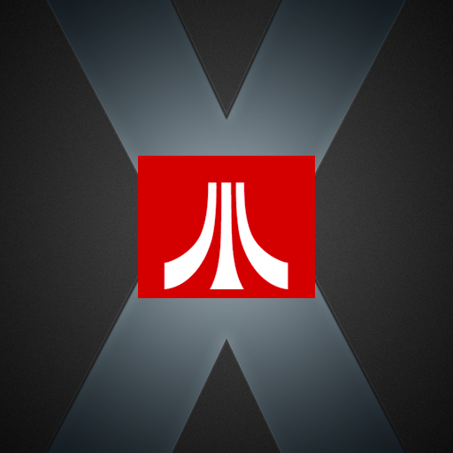
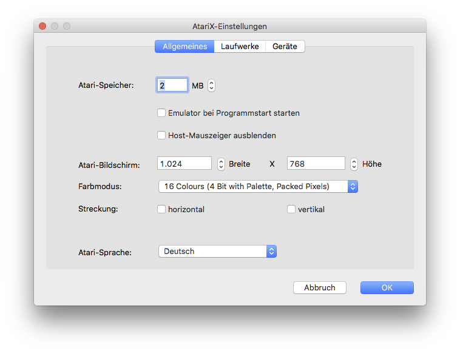
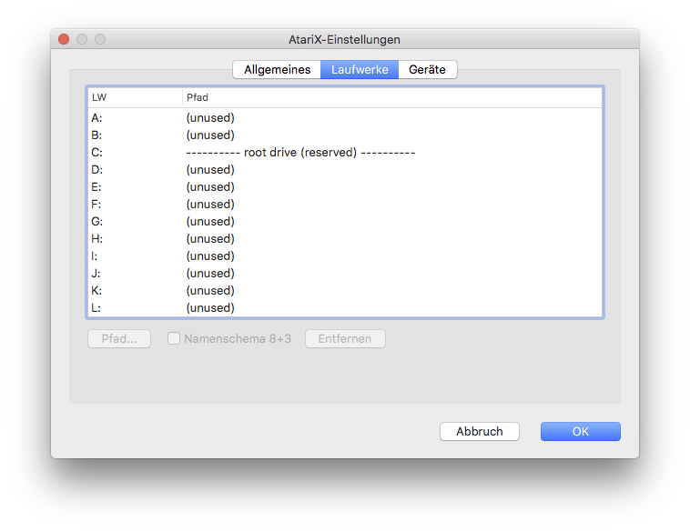
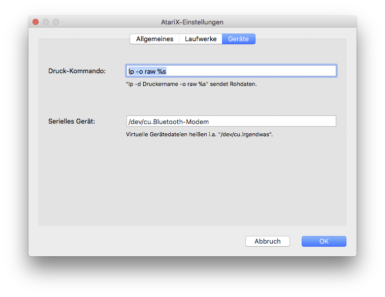

Latest snapshot: 

# Atari X

An Atari ST/TT emulator for **macOS**.

This is kind of successor of *MagiC* for Atari, *MagicMac* for Classic Mac OS and *MagicMac X* for MacOS X.

***

Contrary to its predecessor it does not contain the highly optimized Asgard68k emulator, written in hand optimised PPC assembler, but a portable emulator called Musashi, written in plain C. Thus it will not reach the same emulation speed as MagicMacX, but on the other hand modern Intel chips might be faster than a PPC 970.

***

# Important

The application has been developed until end of 2014. First tests showed that it seems to run under macOS 10.13 "High Sierra", but one has to **manually create a directory MAGIC_C**, preferably in the Documents folder, then start AtariX, **select the newly created directory** as root drive (will appear as "C:" in emulation), initialise the drive and then start the emulator.

# Screenshots

# Supported

* Emulates MC68020 processor
* Arbitrary screen sizes and colour depths
* Zoom, helpful for original 640x400 or 640x200 resolution
* Full access to macOS file system, up to root
* German, French and English localisation for emulator
* German, French and English localisation for emulated system

# Bugs and Agenda

* Musashi emulator sources must be synchronised with latest version (see below).
* MAGIC_C folder must be automatically created.
* Application should be created with latest XCode.
* tell me

# License

The AtariX emulator is licensed according to GPLv3, see LICENSE file.

# External Licenses

**Musashi 68k emulator in C**  
Copyright 1998-2002 Karl Stenerud  
Source: https://github.com/kstenerud/Musashi  
License: https://github.com/kstenerud/Musashi/blob/master/readme.txt  

**SDL library:**  
Source: https://www.libsdl.org  
Copyright: paultaylor@jthink.net  
License: https://www.libsdl.org/license.php  

**Atari VDI Drivers**  
Copyright: Wilfried und Sven Behne  
License: mit freundlicher Genehmigung  
